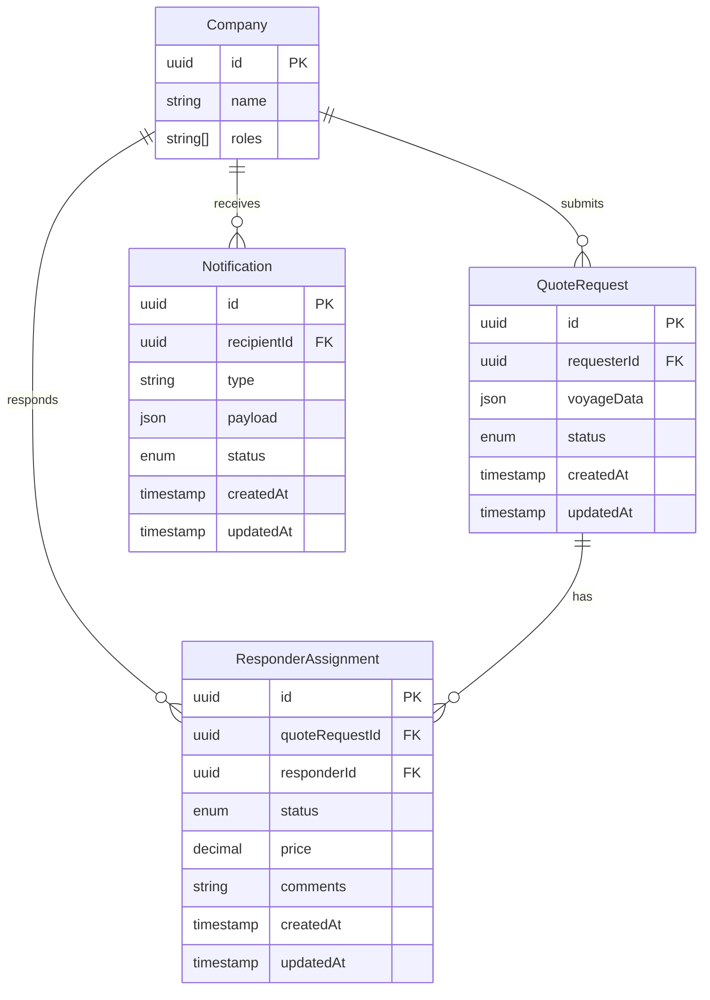
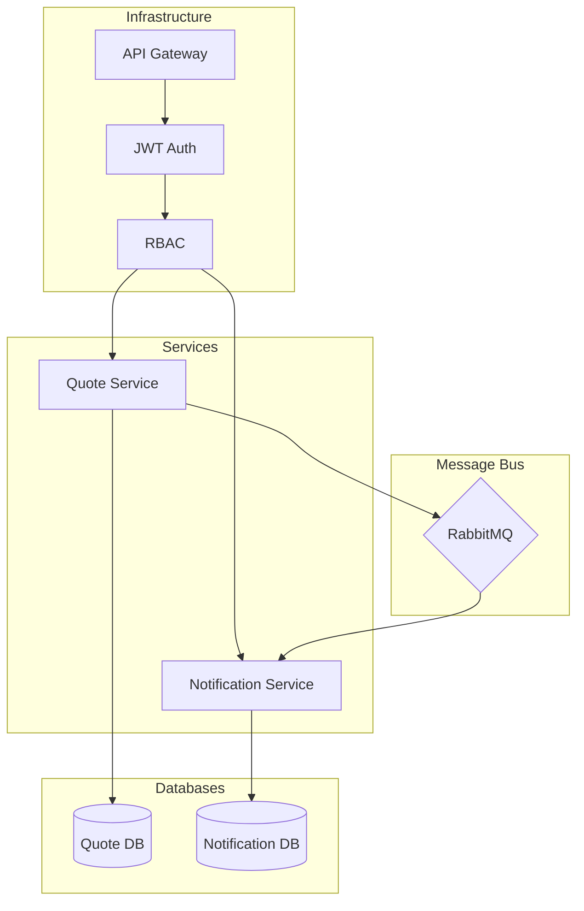

# Shipping Quote System

A multi-tenant system for managing shipping quotes between cargo owners and shipping ensurance companies.

## Assumptions & Open Questions

1. **Multi-tenancy Model**
   - Each company (requester/responder) is a separate tenant
   - Companies can't access each other's data
   - Companies may act only as requesters or responders not both
   - User ↔ Company: A user belongs to exactly one company (tenant)
   - Roles: requester, responder
   - Responder visibility: Responders see only their QuoteAssignment, never other bids.

2. **Authentication & Authorization**
   - JWT-based authentication
   - Role-based access control (requester/responder roles)
   - Token includes company ID for tenant isolation

3. **Quote Request Flow**
   - QuoteRequest state: Draft → Submitted → Closed(Accepted | Rejected | Cancelled)
   - Drafts stay client‑side: Backend receives only the final Submit payload.
   - Requesters can submit quote requests to multiple responders
   - Responders can only see requests assigned to them
   - Responders can not see if Requester assigned to other Responders
   - Exactly‑one acceptance: Requester can accept one response; others auto‑rejected
   - Cancellation window: Allowed only before any response is accepted.
   - No file uploads: All payloads are JSON; attachments out‑of‑scope.

4. **Data Isolation**
   - Separate databases per service for scalability
   - Row-level tenant isolation in each service
   - Shared package for common authentication/authorization
   - Voyage data shape: Stored as a JSON blob; schema validation deferred to future iteration.

5. **Notifications**
   - Async notifications via RabbitMQ
   - Email/SMS integration not implemented in spike
   - Event-driven architecture for scalability
   - Notifications are pull: Frontend polls GET /notifications; WebSocket push is out‑of‑scope.

6. **Audit**
   - Async notifications via RabbitMQ
   - Audit log is append‑only: No updates/deletes; immutable history for compliance.
   - Tenant can se only their actions

7. **API**
   - API versioning: Single version (v1) for spike; path‑based versioning when needed.
   - Time‑zone: All timestamps stored as UTC; UI converts to locale.

## High-Level Data & Tenant Model



## API Design

### Submit Quote Request
```http
POST /api/quote-requests
Authorization: Bearer <jwt>
Content-Type: application/json

Request:
{
  "voyageData": {
    "departurePort": {
      "code": "CNSHA",
      "name": "Shanghai"
    },
    "destinationPort": {
      "code": "NLRTM",
      "name": "Rotterdam"
    },
    "cargoType": "CONTAINER",
    "cargoWeight": 25000,
    "vesselType": "CONTAINER_SHIP",
    "departureDate": "2024-08-15"
  },
  "responderIds": ["company-2", "company-3"]
}

Success Response (201 Created):
{
  "id": "550e8400-e29b-41d4-a716-446655440000",
  "status": "PENDING",
  "voyageData": { ... },
  "createdAt": "2024-07-02T23:35:47.000Z"
}

Error Responses:
401 Unauthorized:
{
  "statusCode": 401,
  "message": "Unauthorized",
  "error": "Invalid token"
}

403 Forbidden:
{
  "statusCode": 403,
  "message": "Forbidden",
  "error": "Insufficient permissions"
}

400 Bad Request:
{
  "statusCode": 400,
  "message": "Validation failed",
  "errors": [
    {
      "field": "voyageData.cargoWeight",
      "message": "must be a positive number"
    }
  ]
}
```

### Send Quote Response
```http
POST /api/quote-requests/{requestId}/responses
Authorization: Bearer <jwt>
Content-Type: application/json

Request:
{
  "price": 50000.00,
  "comments": "Available vessel: MV EXAMPLE. Transit time: 30 days"
}

Success Response (201 Created):
{
  "id": "550e8400-e29b-41d4-a716-446655440001",
  "status": "SUBMITTED",
  "price": 50000.00,
  "comments": "Available vessel: MV EXAMPLE. Transit time: 30 days",
  "createdAt": "2024-07-02T23:35:47.000Z"
}

Error Responses:
404 Not Found:
{
  "statusCode": 404,
  "message": "Quote request not found"
}

409 Conflict:
{
  "statusCode": 409,
  "message": "Response already submitted"
}

403 Forbidden:
{
  "statusCode": 403,
  "message": "Not authorized to respond to this quote request"
}
```

### Accept Quote Response
```http
POST /api/quote-requests/{requestId}/responses/{responderId}/accept
Authorization: Bearer <jwt>
Content-Type: application/json

Success Response (200 OK):
{
  "id": "550e8400-e29b-41d4-a716-446655440000",
  "status": "ACCEPTED",
  "acceptedResponse": {
    "id": "550e8400-e29b-41d4-a716-446655440001",
    "responderId": "company-2",
    "status": "ACCEPTED",
    "price": 50000.00
  },
  "updatedAt": "2024-07-02T23:35:47.000Z"
}

Error Responses:
404 Not Found:
{
  "statusCode": 404,
  "message": "Quote request or response not found"
}

409 Conflict:
{
  "statusCode": 409,
  "message": "Quote request already finalized"
}

403 Forbidden:
{
  "statusCode": 403,
  "message": "Not authorized to accept responses for this quote request"
}
```

## Architecture



## Code Structure

```
.
├── apps
│   └── backend
│       ├── notification-service
│           └── src/
│               ├── api/              # API layer (controllers, DTOs)
│               ├── application/      # Application services
│               ├── config/           # Configuration
│               ├── domain/           # Domain entities and logic
│               └── infrastructure/   # External services and persistence
│       └── quote-service
│           └── src/
│               ├── api/              # API layer (controllers, DTOs)
│               ├── application/      # Application services
│               ├── config/           # Configuration
│               ├── domain/           # Domain entities and logic
│               └── infrastructure/   # External services and persistence
├── packages
│   └── shared
└── docker-compose.yml
```

- **notification-service**: Handles notification delivery and management
- **quote-service**: Core service for quote request workflow
- **shared**: Common utilities, auth, and types

## CI/CD Pipeline

- GitHub Actions workflow with conditional execution
- Path-based triggers for service-specific builds
- Shared package changes trigger all service builds
- Docker images built and cached for each service
- pnpm workspace for dependency management

## Technical Trade-offs

1. **Tenant Isolation**
   - Row-level isolation vs separate databases
   - Chose row-level for simplicity and resource efficiency
   - JWT carries tenant context for consistent isolation

2. **RBAC Implementation**
   - Role checks in shared middleware
   - Roles stored in JWT claims
   - Trade-off between token size and database lookups

3. **Notification System**
   - Event-driven via RabbitMQ
   - Separate service for scalability
   - Basic implementation without external providers

4. **Spike Limitations**
   - No email/SMS integration
   - Basic error handling
   - Limited validation
   - No rate limiting
   - Minimal observability

## Setup

1. Install dependencies:
```bash
pnpm install
```

2. Copy environment files:
```bash
cp apps/backend/quote-service/.env.example apps/backend/quote-service/.env
cp apps/backend/notification-service/.env.example apps/backend/notification-service/.env
```

3. Start services:
```bash
docker-compose up -d
```

4. Run tests:
```bash
pnpm -r test
```

## Event-Driven Notifications

The notification service consumes events from RabbitMQ and processes them accordingly:

### Quote Request Events
```typescript
interface QuoteRequestCreatedEvent {
  type: 'QUOTE_REQUEST_CREATED';
  payload: {
    requestId: string;
    requesterId: string;
    responderIds: string[];
    voyageData: VoyageData;
  };
}

interface QuoteResponseSubmittedEvent {
  type: 'QUOTE_RESPONSE_SUBMITTED';
  payload: {
    requestId: string;
    requesterId: string;
    responderId: string;
    price: number;
  };
}

interface QuoteRequestAcceptedEvent {
  type: 'QUOTE_REQUEST_ACCEPTED';
  payload: {
    requestId: string;
    requesterId: string;
    responderId: string;
    rejectedResponderIds: string[];
  };
}
```

### Notification Types
1. **New Quote Request**
   - Triggered when: A requester creates a new quote request
   - Recipients: All assigned responders
   - Channel: In-app notification + Email (future)

2. **Quote Response Submitted**
   - Triggered when: A responder submits a quote
   - Recipients: Request creator
   - Channel: In-app notification + Email (future)

3. **Quote Response Accepted**
   - Triggered when: A requester accepts a quote
   - Recipients: Accepted responder and all rejected responders
   - Channel: In-app notification + Email (future)

## Sample Calls

Get a JWT token:
```bash
## Create a requester jwt
npx tsx packages/shared/src/auth/generate-jwt.ts --userId=user-a-1 --email=requester@companya.com --companyId=496efeff-28a5-43a1-9813-dadb5f298e7e --roles=requester

## Create a responder jwt
npx tsx packages/shared/src/auth/generate-jwt.ts --userId=user-b-1 --email=respondera@companyb.com --companyId=3fa85f64-5717-4562-b3fc-2c963f66afa6 --roles=responder

## Create another responder jwt
npx tsx packages/shared/src/auth/generate-jwt.ts --userId=user-b-2 --email=responderb@companyb.com --companyId=3fa85f64-5717-4562-b3fc-2c963f66afa7 --roles=responder
```

### Using Swagger UI

1. Open the Swagger UI for Quote Service at `http://localhost:8080/api/v1/quotes/docs` and at `http://localhost:8080/api/v1/notifications/docs`
2. Click the "Authorize" button
3. Enter your JWT token in the format: `Bearer YOUR_TOKEN`
4. Click "Authorize" to apply the token to all requests
5. Test the endpoints with the authorized session

### Quote Requests
```bash
# Submit a quote request
curl -X 'POST' \
  'http://localhost:8080/api/v1/quotes/quote-requests' \
  -H 'accept: application/json' \
  -H 'Authorization: Bearer <token>' \
  -H 'Content-Type: application/json' \
  -d '{
  "responderIds": [
    "3fa85f64-5717-4562-b3fc-2c963f66afa6",
"3fa85f64-5717-4562-b3fc-2c963f66afa7"
  ],
  "voyageData": {
    "departurePort": {
      "code": "SGSIN",
      "name": "Singapore"
    },
    "destinationPort": {
      "code": "SGSIN",
      "name": "Singapore"
    },
    "cargoType": "CONTAINER",
    "cargoWeight": 0,
    "vesselType": "CONTAINER_SHIP",
    "departureDate": "2025-07-03T06:03:48.314Z"
  }
}'

# Get quote requests (as requester)
curl -X 'GET' \
  'http://localhost:8080/api/v1/quotes/quote-requests/my-requests' \
  -H 'accept: application/json' \
  -H 'Authorization: Bearer <token>'

# Get assigned quote requests (as responder)
curl -X 'GET' \
  'http://localhost:8080/api/v1/quotes/quote-requests/my-pending-requests' \
  -H 'accept: application/json' \
  -H 'Authorization: Bearer <token>'

# Submit a response to quote request (as responder)
curl -X 'PUT' \
  'http://localhost:8080/api/v1/quotes/quote-requests/{quoteRequestId}/response' \
  -H 'accept: application/json' \
  -H 'Authorization: Bearer <token>' \
  -H 'Content-Type: application/json' \
  -d '{
  "price": 50000,
  "comments": "Price includes fuel surcharge and port fees"
}'

# Accept response offer for a quote request (as requester)
curl -X 'PUT' \
  'http://localhost:8080/api/v1/quotes/quote-requests/{quoteRequestId}/accept/{requesterId}' \
  -H 'accept: application/json' \
  -H 'Authorization: Bearer <token>'
```

### Quote Responses
```bash
# Submit a quote response
curl -X POST http://localhost:3000/api/quote-requests/{requestId}/responses \
  -H 'Authorization: Bearer <token>' \
  -H 'Content-Type: application/json' \
  -d '{
    "price": 50000.00,
    "comments": "Available vessel: MV EXAMPLE. Transit time: 30 days"
  }'

# Accept a quote response
curl -X POST http://localhost:3000/api/quote-requests/{requestId}/responses/{responderId}/accept \
  -H 'Authorization: Bearer <token>'
```

### Notifications
```bash
# Get notifications for current tenant
curl -X 'GET' \
  'http://localhost:8080/api/v1/notifications/notifications/tenant?limit=10&offset=0' \
  -H 'accept: application/json' \
  -H 'Authorization: Bearer <token>'
```
